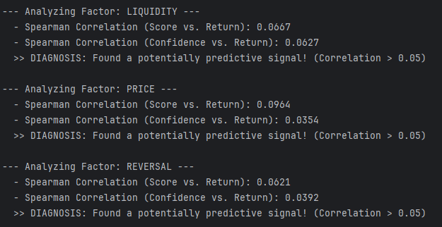

# Event-Driven Backtester for Quantitative Strategies
[](https://opensource.org/licenses/MIT)

An event-driven backtesting framework in Python for developing and testing quantitative trading strategies. The system is designed to be adaptive, with a core engine that adjusts its behavior based on changing market conditions.

---

### Core Components

-   **Multi-Factor Model:** Generates trading signals using a combination of four factors: `Reversal`, `Liquidity`, `Momentum`, and `Price`. The logic for each factor is adjusted based on the current market state (e.g., Bull, Bear, Crisis).

-   **Bayesian Learning Module:** Includes a module that attempts to predict the Expected Value (EV) of signals by learning from the outcomes of past trades.

-   **Risk Management:**
    -   **Market State Detection:** Uses statistical models like GARCH to classify the market into different states.
    -   **Dynamic Exposure:** Smoothly adjusts the total portfolio investment level based on how much the current market deviates from historical patterns.

-   **Walk-Forward Optimization (WFO):** Provides a framework to test and optimize the strategy's key parameters on out-of-sample data, aiming to ensure its robustness.

-   **Performance & Diagnostics:**
    -   **Parallel Processing:** Uses multiple CPU cores to speed up the calculation of alpha factors.
    -   **Data Caching:** Saves the results of time-consuming calculations to make subsequent runs faster.
    -   **Analysis Tools:** Generates performance reports, visualizations, and a detailed log of all trades (`ml_training_data.csv`) for further analysis.

---

### Technologies Used

Python | Pandas | NumPy | Statsmodels | Plotly | scikit-optimize | yfinance

---

### How to Run

1.  **Clone the repository:**
    ```bash
    git clone https://github.com/your-username/your-repo-name.git
    cd your-repo-name
    ```

2.  **Set up the environment and install dependencies:**
    ```bash
    python -m venv .venv
    source .venv/bin/activate  # On Windows: .venv\Scripts\activate
    pip install -r requirements.txt
    ```

3.  **Configure API Key (Optional):**
    To fetch macroeconomic data from FRED, create a `.env` file with your API key:
    ```bash
    echo "FRED_API_KEY=your_api_key_here" > .env
    ```

4.  **Run the backtest:**
    ```bash
    python main.py
    ```

### Outputs

The generated files depend on the run mode set in `strategy_config.py`.

| Run Mode          | Output Files                      | Description                                                 |
| :---------------- | :-------------------------------- | :---------------------------------------------------------- |
| **Single Backtest** | `detailed_backtest_analysis.html` | An interactive dashboard of the backtest performance.       |
|                   | `equity_curve.png`                | A static plot of the strategy's equity curve.               |
| **WFO Run**       | `wfo_results_...csv`              | A summary of optimized parameters from each WFO fold.       |
|                   | `trade_details_wfo_run.csv`       | A complete list of trades from all out-of-sample periods.   |
| **All Runs**      | `ml_training_data.csv`            | A detailed log of all trade outcomes for analysis.          |

---

### Key Findings & Future Research Directions

This project serves as an active research platform for designing and testing adaptive trading systems. A series of controlled experiments were conducted to analyze the system's core components, leading to several key findings.

#### 1. Overall Strategy Performance


*<p align="center">Figure 1: Comparison of the final strategy's equity curve against the SPY benchmark over the full backtest period. The system demonstrates a distinct risk-return profile, particularly during periods of high market stress like the 2008 and 2020 crises.</p>*

<br>

#### 2. Signal Quality Analysis: A 2x2 Experiment

To understand the source of predictive power, we conducted a 2x2 experiment analyzing the quality of alpha signals under different model configurations. The quality is measured by the Spearman rank correlation between the signal scores and subsequent returns.

<table align="center">
  <tr>
    <td align="center" width="50%"></td>
    <td align="center" width="50%"></td>
  </tr>
  <tr>
    <td align="center"><b>Figure 2a: Weak Prior, Learning Disabled</b></td>
    <td align="center"><b>Figure 2b: Weak Prior, Learning Enabled</b></td>
  </tr>
  <tr>
    <td></td>
    <td></td>
  </tr>
  <tr>
    <td align="center"><b>Figure 2c: Base Prior, Learning Disabled</b></td>
    <td align="center"><b>Figure 2d: Base Prior, Learning Enabled</b></td>
  </tr>
  <tr>
    <td></td>
    <td></td>
  </tr>
</table>

*<p align="center"><i><b>Figure 2</b>: Diagnostic plots showing the correlation between signal scores and returns. Each quadrant represents a different experimental setup.</i></p>*

#### 3. Interpretation of Experimental Results

The 2x2 experiment reveals several objective patterns:

1.  **Baseline Signal Power (Fig. 2a & 2c):** With the learning engine disabled, the raw alpha signals from the factors exhibit a weak but statistically positive correlation with future returns (Spearman's ρ ≈ 0.06-0.09). This forms the baseline predictive power.

2.  **Impact of the Learning Engine (Comparing Left vs. Right):** Enabling the Bayesian learning engine (`EV On`) significantly amplifies the predictive power of the signals, especially for the `Price` and `Reversal` factors. This effect is most pronounced in the **Weak Prior** setting (Fig. 2b), where the correlation for these factors **jumps to > 0.20**. This indicates the learning algorithm itself is effective at processing and enhancing noisy signals.

3.  **Impact of Prior Knowledge (Comparing Top vs. Bottom):** The model initialized with a **Weak Prior** (Fig. 2b) produces significantly stronger final signals than the model initialized with a handcrafted **Expert Prior** (Fig. 2d). This suggests that in this non-stationary environment, allowing the model to learn from data with minimal initial bias is a more effective approach than relying on fixed, historical "expert knowledge."

4.  **The Execution Bottleneck:** A key finding is that while the best model configuration (Fig. 2b) produces high-quality predictive signals, the final portfolio-level performance improvement is only marginal. This points to a bottleneck in the current portfolio construction and execution logic, where the value of superior signals is not being fully translated into returns.

---

### Potential Research Directions

Based on these findings, I am actively exploring the following research directions to enhance the system's intelligence and robustness:

#### 1. Intelligent Execution with Reinforcement Learning

*   **Question:** Instead of trying to perfect a long-term forecast, can we generate "execution alpha" by learning the optimal *short-term* trading policy?
*   **Hypothesis:** The small edge in the raw signals can be dramatically amplified by an intelligent agent that adapts to intraday market dynamics and macro-economic regimes.
*   **Potential Method:** Develop a **Hierarchical Reinforcement Learning** framework. A strategic layer would identify the market regime (inspired by works on MMC clustering), and a tactical RL agent would learn the optimal execution policy for each regime (inspired by works on Policy Gradients for execution).

#### 2. Advanced Bayesian Workflow and Diagnostics

*   **Question:** Why is the current Bayesian EV model failing, and how can we build a more reliable one?
*   **Hypothesis:** The model's failure is not a failure of Bayesian methods themselves, but a result of a flawed modeling process (e.g., poor choice of priors, model misspecification).
*   **Potential Method:** Implement a systematic **Bayesian Workflow** for model development. This would involve:
    *   Applying advanced diagnostic tools like **Visual Predictive Checks (VPC)** and **Simulation-Based Calibration (SBC)** to deeply understand the current model's failure modes.
    *   Exploring more **structured, informative priors** that can better incorporate domain knowledge about the alpha signals.
    *   Investigating methods to handle the **non-stationarity (concept drift)** of financial data within the Bayesian framework.

#### 3. Alpha Factor Engineering & Refinement

*   **Question:** Can we improve the foundational predictive power of the raw alpha signals themselves?
*   **Hypothesis:** The current alpha factors can be refined or combined in non-linear ways to create stronger, more robust signals.
*   **Potential Method:**
    *   Conduct a deep-dive analysis into the failure of the `Reversal` factor.
    *   Explore feature engineering techniques to create interaction terms between factors.
    *   Use machine learning models (e.g., Gradient Boosting Trees) to explore non-linear relationships between raw indicators and future returns.